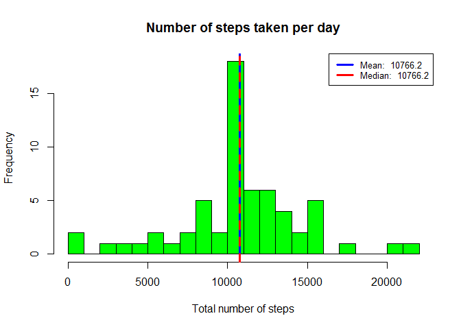
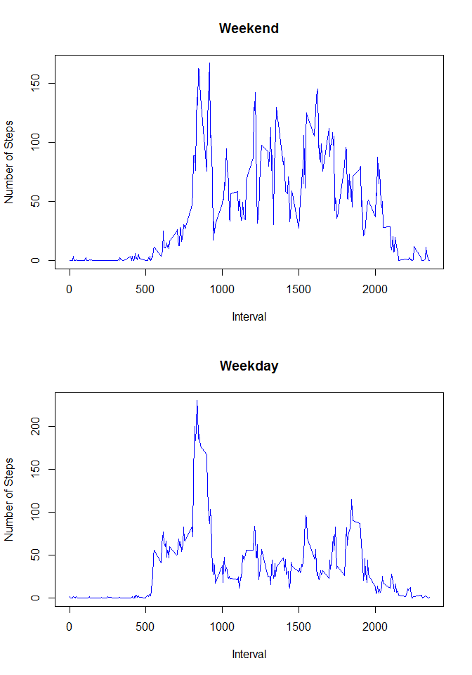

# Reproducible Research: Peer Assessment 1


## **Loading and preprocessing the data**


1. Load data file from the working directory (make sure data filr is present in working directory).
2. Assign it to a variable called "file".


```r
file=read.csv("activity.csv", header=T)
```


## **What is mean total number of steps taken per day?**


1. Calcualte the total number of steps taken perday
2. Calculate the mean and median of the total number of steps taken per day
3. Make a histogram of the total number of steps taken each day
    * Mean and median are plotted on the histogram and values indicated in the legend
    * Mean and median values are very close for this data set so lines are overlapping on the graph


```r
steps=aggregate(steps ~ date, data = file, FUN = sum)

      mean_steps=round(mean(steps$steps),1)
      median_steps=median(steps$steps, na.rm=TRUE)
      
      
hist(steps$steps, breaks = 20, 
            col= "green", 
            main = "Number of steps taken per day", 
            xlab= "Total number of steps")

      abline(v=mean_steps, lwd = 3, col = 'blue')
      abline(v=median_steps, lwd = 3, col = 'red', lty=2)
      legend('topright', lty = 1, lwd = 3, col = c("blue", "red"),
              cex = .8, 
              legend = c(paste('Mean: ', mean_steps),
              paste('Median: ', median_steps))
          )
```

 


## **What is the average daily activity pattern?**


```r
##Calculate average per time interval      
number.interval <- aggregate(steps ~ interval, data = file, FUN = mean)
      
##Calculate Interval That Has The Maximum Avg Steps       
max_interval=number.interval$interval[which.max(number.interval$steps)]

##Set variable for the average steps in the above calculated interval
max_steps<-round(number.interval$steps[which(number.interval$interval==max_interval)],1)

##Create label to display maximum steps and the time interval on the plot
max_label = paste('Maximum Of ', max_steps, ' Steps \n On ', max_interval, 'th Time Interval', sep = '')

##Plot data
plot(number.interval, type = "l",
     col="blue",
     main = 'Average Steps by Time Interval',
     xlab = '5 Minute Time Interval',
     ylab = 'Average Number of Steps')

##Set coordinates to display the Max Interval on the plot
points(max_interval, max_steps, col = 'red', lwd = 3, pch = 19)

##Set legend on the graph
legend("topright",
       legend = max_label,
       text.col = 'red',
       bty = 'n'
)
```

 


## **Imputing missing values**
* I will use the means for the 5-minute intervals calculated earlier to fill for the missing values
* Create a new dataset that is equal to the original dataset but with the missing data filled in


```r
##Merge dataframe  created earlier that summarizes the average number of steps per interval to the original dataset
activity_Impute <- merge(file, number.interval, by = "interval", suffixes = c("", ".AVG"))

##Replace NAs with average values
nas <- is.na(activity_Impute$steps)
activity_Impute$steps[nas] <- activity_Impute$steps.AVG[nas]
activity_Impute <- activity_Impute[, c(1:3)]
```

###*Create histogram using imputed data and calculate mean and median total number of steps taken per day*


```r
steps2=aggregate(steps ~ date, data = activity_Impute, FUN = sum)

mean_steps2=round(mean(steps2$steps),1)
median_steps2=round(median(steps2$steps),1)


hist(steps2$steps, breaks = 20, 
     col= "green", 
     main = "Number of steps taken per day", 
     xlab= "Total number of steps")

abline(v=mean_steps2, lwd = 3, col = 'blue')
abline(v=median_steps2, lwd = 3, col = 'red', lty=2)
legend('topright', lty = 1, lwd = 3, col = c("blue", "red"),
       cex = .8, 
       legend = c(paste('Mean: ', mean_steps2),
                  paste('Median: ', median_steps2))
)
```

 

## **Are there differences in activity patterns between weekdays and weekends?**


```r
##Create a new factor variable in the dataset with two levels -- "weekday" and "weekend" indicating whether a given date is a weekday or weekend day.
day_type <- function(date) {
  if (weekdays(as.Date(date)) %in% c("Saturday", "Sunday")) {
    "Weekend"
  } else {
    "Weekday"
  }
}
activity_Impute$day_type <- as.factor(sapply(activity_Impute$date, day_type))

##Make a panel plot containing a time series plot (i.e. type = "l") of the 5-minute interval (x-axis) and the average number of steps taken, averaged across all weekday days or weekend days (y-axis).

par(mfrow = c(2, 1))
for (type in c("Weekend", "Weekday")) {
  steps_type <- aggregate(steps ~ interval, data = activity_Impute, subset = activity_Impute$day_type == 
                            type, FUN = mean)
  plot(steps_type, type = "l", col= "blue", main = type, xlab = "Interval", ylab = "Number of Steps")
}
```

 

